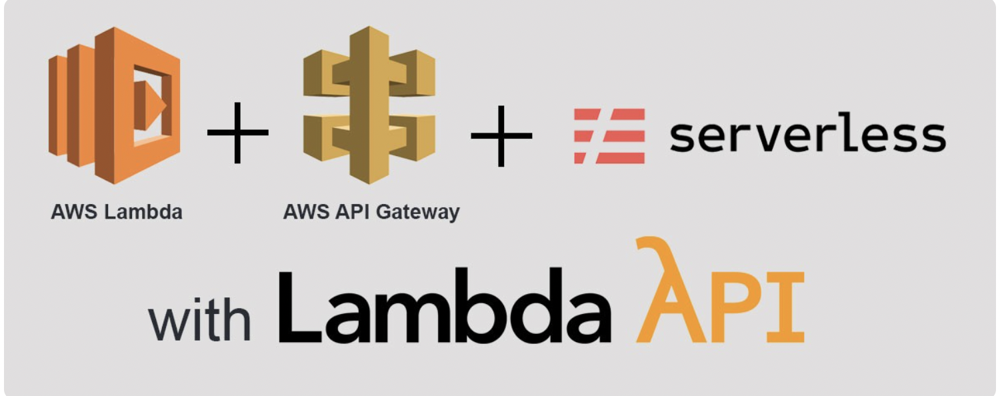
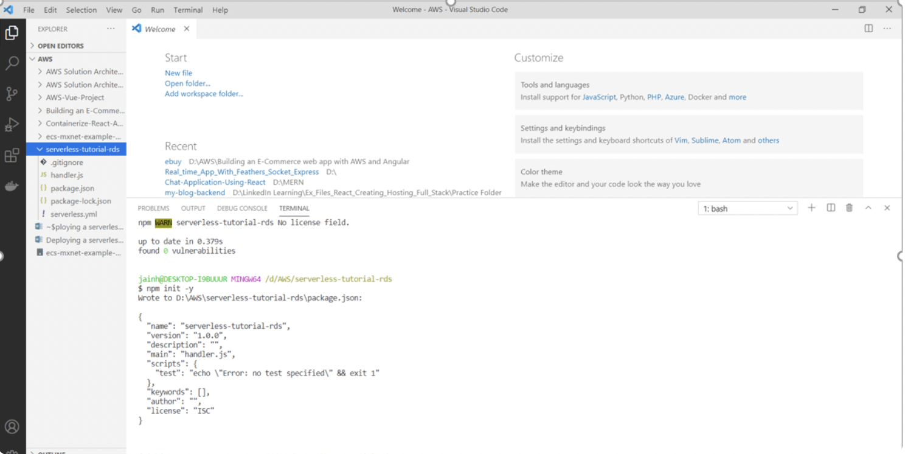
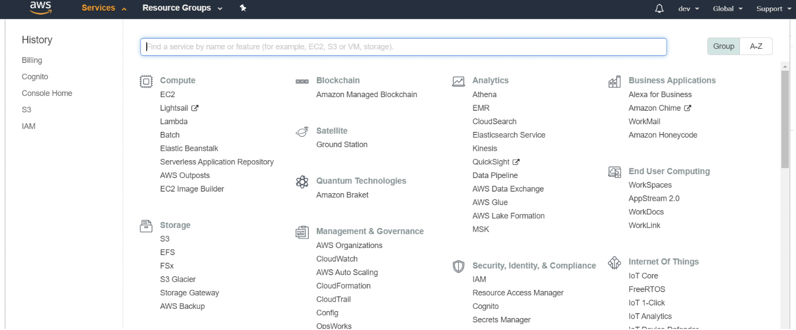

# serverless-rest-api-with-aws-lambda



In this article, I’ll be making use of the **Serverless Framework** to build and deploy a simple **Node.js API to Lambda and API Gateway**. Our data will be stored using **Amazon Relational Database Service (RDS) for PostgreSQL.**

# Objective

1. Developing a Serverless framework based application using Node.js to build and deploy it to AWS Lambda and AWS API Gateway.
2. Backing up the application with an Amazon Relational Database Service (RDS) for PostgreSQL,using pgAdmin for creation of database and table with the required columns.
3. Fully verifying the implemented REST APIs using Postman running the application on the localhost server on current machine, later migrated the deployment completely on the AWS Lambda and AWS API Gateway services.

# Pre-Requisite

1. Node.js version 6.x or later installed locally on your machine. You can get it here (https://nodejs.org/en/download/).
2. An AWS account, which you can create here (https://aws.amazon.com/resources/create-account/).
3. We’ll be using pgAdmin to create our database tables, you can download that here (https://www.pgadmin.org/download/).
4. Postman, a super handy tool we’ll be using to test our API. Get that here (https://www.postman.com/).

Once you are done with all the pre-requisite installation and setup,we can now proceed ahead in developing the REST API backend application.

# Installing the Serverless Framework CLI

Let’s start by installing the serverless npm package. By using the -g flag, the package is installed globally on your machine.

```npm install -g serverless```

# Creating a new project

```serverless```

Running the command **serverless** will guide you through creating a new serverless project.

Select **AWS Node.js** as your template and then provide a meaningful name for the project. I’ll give my project name as **serverless-tutorial-rds**.

Once you have done with the above command, you would be having the sample serverless framework template folder generated for Node.js app.

Now to add a **package.json** file by initialising the directory as a new npm package. Firstly navigate into the new projects directory and then run **npm init**. You can use the flag -y to skip the various npm package settings.

```cd serverless-tutorial-rds```

```npm init -y```

# Project Structure
Open the project in your text editor of choice and you’ll see what files were created for us. The **Serverless.yml** file is where we define our functions, the events that trigger them, and the resources they use. The **handler.js** file is where we will maintain the logic for our functions.



# Configuring Amazon Credentials
Before we write any code, let’s configure our amazon credentials to ensure we can deploy our project. In a new tab, open the AWS Management Console and navigate to the IAM service.



Select users on the sidebar navigation menu and then press Add user. Make sure for the access type you select programmatic access.

You should now be prompted to add specific permissions. You can add the user to a group, copy permissions from an existing user or attach inline policies directly. For this project, we’ll create a new group. We’ll need the following permissions:

- AmazonRDSFullAccess
- AWSLambdaFullAccess
- IAMFullAccess
- AmazonAPIGatewayAdministrator
- AWSCloudFormationFullAccess

**Add your user to the newly created group and then proceed to create the user.**