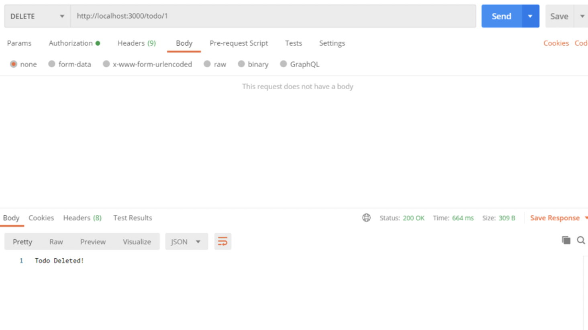

# serverless-rest-api-with-aws-lambda


In this article, I’ll be making use of the **Serverless Framework** to build and deploy a simple **Node.js API to Lambda and API Gateway**. Our data will be stored using **Amazon Relational Database Service (RDS) for PostgreSQL.**

# Objective

1. Developing a Serverless framework based application using Node.js to build and deploy it to AWS Lambda and AWS API Gateway.
2. Backing up the application with an Amazon Relational Database Service (RDS) for PostgreSQL,using pgAdmin for creation of database and table with the required columns.
3. Fully verifying the implemented REST APIs using Postman running the application on the localhost server on current machine, later migrated the deployment completely on the AWS Lambda and AWS API Gateway services.

# Pre-Requisite

1. Node.js version 6.x or later installed locally on your machine. You can get it here (https://nodejs.org/en/download/).
2. An AWS account, which you can create here (https://aws.amazon.com/resources/create-account/).
3. We’ll be using pgAdmin to create our database tables, you can download that here (https://www.pgadmin.org/download/).
4. Postman, a super handy tool we’ll be using to test our API. Get that here (https://www.postman.com/).

Once you are done with all the pre-requisite installation and setup,we can now proceed ahead in developing the REST API backend application.

# Installing the Serverless Framework CLI

Let’s start by installing the serverless npm package. By using the -g flag, the package is installed globally on your machine.

```npm install -g serverless```

# Creating a new project

```serverless```

Running the command **serverless** will guide you through creating a new serverless project.

Select **AWS Node.js** as your template and then provide a meaningful name for the project. I’ll give my project name as **serverless-tutorial-rds**.

Once you have done with the above command, you would be having the sample serverless framework template folder generated for Node.js app.

Now to add a **package.json** file by initialising the directory as a new npm package. Firstly navigate into the new projects directory and then run **npm init**. You can use the flag -y to skip the various npm package settings.

```cd serverless-tutorial-rds```

```npm init -y```

# Project Structure
Open the project in your text editor of choice and you’ll see what files were created for us. The **Serverless.yml** file is where we define our functions, the events that trigger them, and the resources they use. The **handler.js** file is where we will maintain the logic for our functions.


# Configuring Amazon Credentials
Before we write any code, let’s configure our amazon credentials to ensure we can deploy our project. In a new tab, open the AWS Management Console and navigate to the IAM service.


Select users on the sidebar navigation menu and then press Add user. Make sure for the access type you select programmatic access.

You should now be prompted to add specific permissions. You can add the user to a group, copy permissions from an existing user or attach inline policies directly. For this project, we’ll create a new group. We’ll need the following permissions:

- AmazonRDSFullAccess
- AWSLambdaFullAccess
- IAMFullAccess
- AmazonAPIGatewayAdministrator
- AWSCloudFormationFullAccess

**Add your user to the newly created group and then proceed to create the user.**


On successful creation, you should be able to see the Access key ID and the Secret access key. Head back to your terminal and enter the following command to configure your security credentials. 
**Remember to replace ‘<your_access_key>’ and ‘<your_secret_key’> with the actual keys.**

```serverless config credentials --provider aws --key <your_access_key> --secret <your_secret_key>```

You can re-check and view the summary of the user and group IAM created above.Later, in part you can add more users to the same group permitting with the same AWS IAM Policies granted to the group.


# Setting up the Amazon RDS Instance

Head over to the RDS service in the AWS Management Console. Navigate to databases and click create database. Make sure to select free tier for the template.


Give your database-cluster an appropriate name, and then set username and password credentials for accessing the database.


To make our lives easier during development and testing, find the dropdown ‘additional connectivity configuration’ under ‘Connectivity’ and set ‘publicly accessible’ to Yes.


The remaining settings can be left at their defaults. It will take a few minutes for Amazon to build the database and make it available for use.

# Connecting RDS PostgreSQL instance with pgAdmin

Now that our database is accessible, we can open pgAdmin and use it to connect. On the dashboard, select add new server.


Give your server a name, note this is just for you. By clicking on the connection tab you can input the specific information relating to the database you created.


# Creating Tables
Select the database on the left menu, select the postgres database, select Schemas, select public, and then right-click Tables and create a new table.

We’ll set the table name to todo and set the columns as follows:


# Building the Serverless REST API Architecture

We’ll build our API to create, edit and delete Todo objects. It will follow the standard REST architecture, making use of the following HTTP methods:

- GET : To return the Todo objects.
- POST : To create a Todo object.
- PUT : To update a Todo object.
- DELETE : To delete a Todo object.

Here is my code for the **serverless.yml** file

```
service: serverless-tutorial-rds
	app: server-app
	

	provider:
	  name: aws
	  runtime: nodejs10.x
	  memorySize: 128
	  timeout: 30
	

	functions:
	

	  getTodo:
	    handler: handler.getTodo
	    events:
	     - http:
	         path: todo/{id}
	         method: get
	         cors: true
	          
	  getAllTodos:
	    handler: handler.getAllTodos
	    events:
	     - http:
	         path: todo
	         method: get
	         cors: true
	

	  createTodo:
	    handler: handler.createTodo
	    events:
	      - http:
	          path: todo
	          method: post
	          cors: true
	              
	  updateTodo:
	    handler: handler.updateTodo
	    events:
	      - http:
	          path: todo/{id}
	          method: put
	          cors: true
	          
	  deleteTodo:
	    handler: handler.deleteTodo
	    events:
	      - http:
	          path: todo/{id}
              method: delete
              cors: true
```

# Database config

In the root directory, create a new folder called config and then create a new file inside of this folder called db.js.

From this file we will export our database credentials as follows:

```
module.exports =  {

	    database: 'postgres',
	    host: 'xxxx.amazonaws.com',
	    port: '5432',
   	    user: 'xxx',
        password: 'xxx'
}
```

Make sure to add this file to your .gitignore before committing to GitHub.

# Postgresql-easy
In order to query the database, we’ll use the npm package postgresql-easy.

```npm install postgresql-easy```

Now, in the root directory create a file called db_connect.js. In this file, we’ll import the db config file, import the postgresql-easy module and then create and export a new postgres connection.

```
const PgConnection = require('postgresql-easy');
const dbConfig = require('./config/db');
const pg = new PgConnection(dbConfig);
module.exports = pg;
```

# Handler.js
At the top of the handler.js file, import the db_connect file.

```const db = require('./db_connect');```

Now let’s write the functions to handle each of the possible requests.

# getAllTodos

The function db.getAll takes a table name as an argument and returns all of its records.

```
module.exports.getAllTodos = (event, context, callback) => {
	    context.callbackWaitsForEmptyEventLoop = false;
	    db.getAll('todo')
	        .then(res => {
	            callback(null, {
	                statusCode: 200,
	                body: JSON.stringify(res)
	            })
	        })
	        .catch(e => {
	            console.log(e);
	            callback(null, {
	                statusCode: e.statusCode || 500,
	                body: 'Error: Could not find Todos: ' + e
	            })

	        })

	};
```

# getTodo

The function db.getById takes two arguments. The first is the Table name and the second is the Id of the record to return. For this function to work, the table must have a column named id.

```
module.exports.getTodo = (event, context, callback) => {
	    context.callbackWaitsForEmptyEventLoop = false;
	    db.getById('todo', event.pathParameters.id)
	    .then(res => {
	        callback(null,{
	            statusCode: 200,
	            body: JSON.stringify(res)
	        })
	    })
	    .catch(e => {
	        callback(null,{
	            statusCode: e.statusCode || 500,
	            body: "Could not find Todo: " + e
	        })
	    })

	};
```

# createTodo

The function db.insert takes two arguments: the table name and the data of the record to be created.

```
module.exports.createTodo = (event, context, callback) => {
  context.callbackWaitsForEmptyEventLoop = false;
  const data ​= JSON.parse(event.body);
  db.insert('todo', data)
    .then(res => {
      callback(null,{
        statusCode: 200,
        body: "Todo Created!" + res
      })
    })
    .catch(e => {
      callback(null,{
        statusCode: e.statusCode || 500,
        body: "Could not create Todo " + e
      })
    })
 
};
```

# updateTodo

The function db.updateById takes three arguments: the table name, the id of the record to be updated, and the data to be updated with. The id is pulled from the URL of the request by using event.pathParameters.id.

```
module.exports.updateTodo = (event, context, callback) => {
  context.callbackWaitsForEmptyEventLoop = false;
  const data ​= JSON.parse(event.body);
  db.updateById('todo', event.pathParameters.id, data)
    .then(res => {
      callback(null,{
        statusCode: 200,
        body: "Todo Updated!" + res
      })
    })
    .catch(e => {
      callback(null,{
        statusCode: e.statusCode || 500,
        body: "Could not update Todo" + e
      })
    }) 

};
```

# deleteTodo

The function db.deleteById takes two arguments: the table name, and the id of the record to be deleted.

```
module.exports.deleteTodo = (event, context, callback) => {
  context.callbackWaitsForEmptyEventLoop = false;
  db.deleteById('todo', event.pathParameters.id)
    .then(res => {
      callback(null,{
        statusCode: 200,
        body: "Todo Deleted!"
      })
    })
    .catch(e => {
      callback(null,{
        statusCode: e.statusCode || 500,
        body: "Could not delete Todo" + e
      })
    })

 
};
```

# Project Testing

The serverless-offline node module allows you to run the server locally such that you can test if the requests are handled correctly.

```npm install serverless-offline```

In order to use the module, it needs to be added as a plugin to the serverless.yml file. Add the following lines to serverless.yml file so that this plugin can help us with the offline local machine testing.

```
plugins:

  - serverless-offline
```

To run the server locally, run the following command.

```serverless offline```

After running the command you should see the available routes printed in the terminal.


# POST

We can use Postman to send requests to these routes and see if our code functions as intended. Let’s start with a POST request to test todo creation. In the body of the request, select the raw option and provide the data for the Todo as a JSON object.


# GET

To test if the record was saved in the database, send a GET request to http://localhost:3000/todo to get all todo Plan. If successful, you should see something like this:


# GET

To test if the record was saved in the database, send a GET request to http://localhost:3000/todo/{id} to get the specific todo Plan with id. If successful, you should see something like this:


# PUT

To test the update method, sent a PUT request to edit todo Plan as follows. I’m going to change the ‘completed’ attributed of my todo to ‘true’.


# DELETE

And finally, the delete request to delete the todo Plan added.



# Deploying
The last step is to deploy the API to AWS lambda. The serverless framework makes this really easy, all we need to do is run the following command.

One step and rest all your REST API would be migrated on AWS platform and served from AWS Lambda and AWS API Gateway service.

```serverless deploy```

# Conclusion
Your API is now ready to to go and serve as a complete statefule backend application...!!
